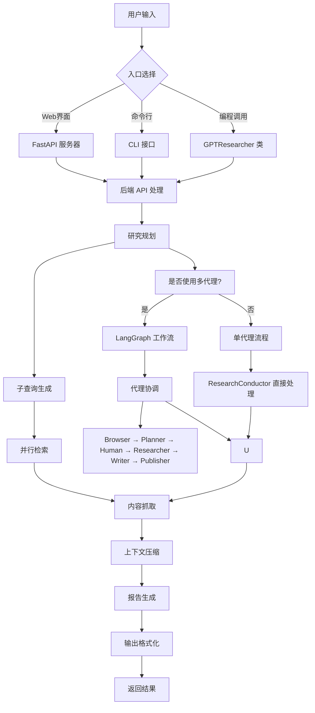
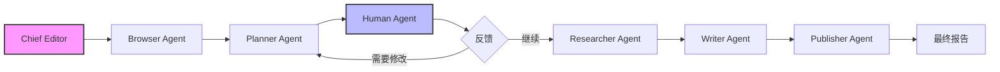

# GPT Researcher 项目整体架构文档

## 项目概述

GPT Researcher 是一个基于 AI 的自动化研究系统，能够对任意给定任务进行全面的网络和本地研究，生成详细、客观、带有引用的研究报告。

## 项目入口点

### 1. 主要入口文件

- **`main.py`** - FastAPI 服务器入口，启动 Web 服务（端口 8000）
- **`cli.py`** - 命令行接口，支持直接生成研究报告
- **`gpt_researcher/__init__.py`** - 包入口，导出 `GPTResearcher` 主类
- **`multi_agents/main.py`** - 多代理系统入口

## 模块层级结构

```
gpt-researcher/
├── gpt_researcher/                    # 核心包
│   ├── agent.py                       # 主代理类 GPTResearcher
│   ├── config/                        # 配置管理
│   │   └── config.py                  # 配置处理类
│   ├── skills/                        # 研究技能模块
│   │   ├── researcher.py              # 研究指挥器
│   │   ├── writer.py                  # 报告生成器
│   │   ├── deep_research.py           # 深度研究
│   │   ├── browser.py                 # 浏览器管理
│   │   ├── context_manager.py         # 上下文管理
│   │   └── curator.py                 # 源管理器
│   ├── retrievers/                    # 数据检索器
│   │   ├── tavily/                    # Tavily 搜索
│   │   ├── google/                    # Google 搜索
│   │   ├── bing/                      # Bing 搜索
│   │   ├── duckduckgo/                # DuckDuckGo 搜索
│   │   ├── arxiv/                     # 学术论文检索
│   │   ├── pubmed_central/            # 医学文献检索
│   │   └── mcp/                       # Model Context Protocol
│   ├── scraper/                       # 网页抓取
│   │   ├── arxiv_scraper.py           # ArXiv 抓取器
│   │   ├── beautifulsoup_scraper.py   # BeautifulSoup 抓取器
│   │   ├── newspaper_scraper.py       # Newspaper 抓取器
│   │   ├── playwright_scraper.py      # Playwright 抓取器
│   │   └── scrapy_scraper.py          # Scrapy 抓取器
│   ├── llm_provider/                  # LLM 提供商
│   ├── vector_store/                  # 向量存储
│   ├── memory/                        # 记忆管理
│   │   ├── embeddings.py             # 嵌入模型管理
│   │   └── memory.py                  # 记忆类
│   └── utils/                         # 工具函数
│       ├── llm.py                     # LLM 通用接口
│       ├── costs.py                   # 成本计算
│       └── logging.py                 # 日志工具
├── backend/                           # 后端服务
│   ├── server/                        # FastAPI 服务器
│   │   ├── server.py                 # 主服务器
│   │   ├── websocket_manager.py       # WebSocket 管理
│   │   └── fast_api_app.py           # FastAPI 应用
│   ├── chat/                          # 聊天功能
│   │   └── chat.py                    # 聊天实现
│   ├── report_type/                   # 报告类型处理
│   └── utils.py                       # 后端工具
├── frontend/                          # 前端界面
│   ├── index.html                     # HTML 主界面
│   ├── nextjs/                        # Next.js 前端
│   └── static/                        # 静态资源
├── multi_agents/                      # 多代理系统
│   ├── agents/                        # 代理实现
│   │   ├── chief_editor_agent.py      # 主编辑代理
│   │   ├── research_agent.py          # 研究代理
│   │   ├── writer_agent.py            # 写作代理
│   │   ├── editor_agent.py            # 编辑代理
│   │   ├── publisher_agent.py         # 发布代理
│   │   ├── human_agent.py             # 人类代理
│   │   ├── reviewer_agent.py          # 审核代理
│   │   └── reviser_agent.py           # 修订代理
│   ├── graphs/                        # 工作流图
│   └── langgraph.json                 # LangGraph 配置
└── mcp-server/                        # MCP 服务器
```

## 核心模块职责

### 1. GPTResearcher 主类 (`agent.py`)
- **职责**: 研究流程的总指挥官
- **功能**: 协调所有技能模块、管理研究状态、处理用户输入输出
- **关键属性**: query, report_type, config, retrievers, memory, skills

### 2. 技能模块 (`skills/`)
- **ResearchConductor**: 研究规划和执行
- **ReportGenerator**: 报告生成和格式化
- **ContextManager**: 上下文压缩和检索
- **BrowserManager**: 网页浏览和抓取
- **SourceCurator**: 源选择和排序
- **DeepResearchSkill**: 深度研究能力

### 3. 检索器模块 (`retrievers/`)
- **Web 搜索**: Tavily, Google, Bing, DuckDuckGo 等
- **学术搜索**: ArXiv, PubMed, Semantic Scholar
- **自定义检索**: 支持扩展新的检索源
- **MCP 集成**: Model Context Protocol 支持

### 4. 多代理系统 (`multi_agents/`)
- **ChiefEditorAgent**: 主编辑，协调其他代理
- **ResearchAgent**: 专门的研究代理
- **WriterAgent**: 专业的写作代理
- **EditorAgent**: 内容规划和编辑
- **PublisherAgent**: 最终输出处理

## 整体执行流程



## 多代理执行流程



## 关键特性

1. **多模态研究**: 支持网页和本地文档研究
2. **多种报告类型**: 摘要、详细、资源报告等
3. **多种语气风格**: 客观、正式、分析性、说服性等
4. **域名过滤**: 限制研究到特定域名
5. **实时更新**: WebSocket 支持实时进度更新
6. **导出选项**: PDF、Word 等格式导出
7. **多代理架构**: 专业化代理分工协作
8. **MCP 支持**: Model Context Protocol 集成
9. **向量存储**: 基于嵌入的搜索和检索
10. **记忆管理**: 研究过程中保持上下文

## 部署选项

1. **开发环境**: `python main.py` - 本地开发服务器
2. **命令行**: `python cli.py` - 命令行研究
3. **Docker**: 完整容器化，包含浏览器自动化
4. **生产环境**: Next.js 前端 + FastAPI 后端