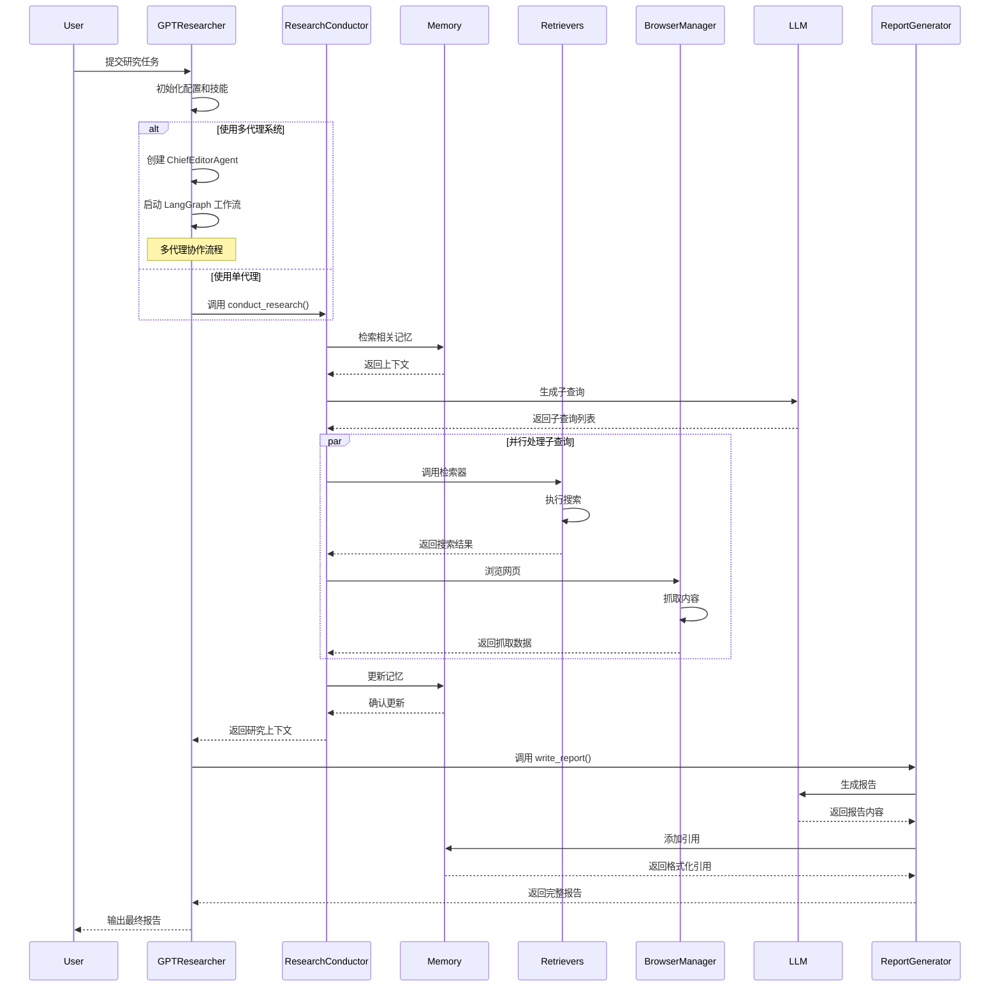
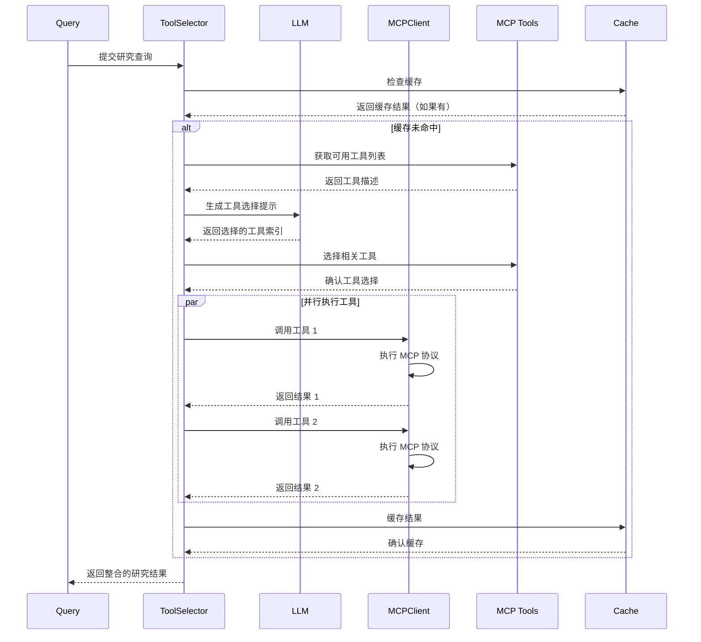

# GPT Researcher AI Agent 专属设计文档

## 1. Memory 系统

### 1.1 记忆架构概述

GPT Researcher 实现了多层记忆系统，包括短期记忆（会话上下文）和长期记忆（向量存储）：

#### 记忆层级结构
```
记忆系统
├── 短期记忆
│   ├── 会话上下文（当前研究任务）
│   ├── 子查询结果缓存
│   └── 已访问 URL 记录
└── 长期记忆
    ├── 向量存储（文档嵌入）
    ├── MCP 结果缓存
    └── 研究历史（可选）
```

### 1.2 短期记忆实现

#### 上下文管理 (`skills/context_manager.py`)
```python
class ContextManager:
    def __init__(self, researcher):
        self.researcher = researcher
        
    async def get_similar_content_by_query(self, query, pages) -> str:
        """基于查询相似性获取内容"""
        
    async def get_similar_content_by_query_with_vectorstore(self, query, filter) -> str:
        """使用向量存储获取相似内容"""
```

#### 上下文压缩机制
- **词数限制**: 最大 25,000 词
- **保留策略**: 保留最新/最相关的内容
- **智能裁剪**: 基于语义相似性裁剪

```python
def trim_context_to_word_limit(context_list: List[str], max_words: int = 25000) -> List[str]:
    """智能裁剪上下文以保持在词数限制内"""
    total_words = 0
    trimmed_context = []
    
    # 反向处理以保留最新内容
    for item in reversed(context_list):
        words = count_words(item)
        if total_words + words <= max_words:
            trimmed_context.insert(0, item)
            total_words += words
        else:
            break
    
    return trimmed_context
```

### 1.3 长期记忆实现

#### 向量存储集成 (`vector_store/vector_store.py`)
- **支持提供商**: OpenAI, Azure, Cohere, Google 等 15+ 提供商
- **文档分块**: 1000 字符/块，200 字符重叠
- **相似性搜索**: 基于嵌入的语义搜索

```python
class VectorStoreWrapper:
    def __init__(self, vector_store: VectorStore):
        self.vector_store = vector_store
        
    async def asimilarity_search(self, query, k, filter) -> List[Document]:
        """异步相似性搜索"""
        
    def load(self, documents):
        """加载文档到向量存储"""
```

#### 嵌入模型管理 (`memory/embeddings.py`)
```python
class Memory:
    def __init__(self, embedding_provider: str, model: str, **embedding_kwargs):
        match embedding_provider:
            case "openai":
                from langchain_openai import OpenAIEmbeddings
                _embeddings = OpenAIEmbeddings(model=model, **embedding_kwargs)
            case "cohere":
                from langchain_cohere import CohereEmbeddings
                _embeddings = CohereEmbeddings(model=model, **embedding_kwargs)
            # ... 其他提供商
```

### 1.4 记忆持久化
- **向量存储持久化**: 文档持久化存储到向量数据库
- **会话缓存**: 研究过程中缓存 MCP 结果避免重复调用
- **状态管理**: 多代理系统中的共享研究状态

## 2. Tool 系统

### 2.1 工具注册机制

#### 检索器系统 (`retrievers/`)
支持 15+ 搜索提供商的模块化系统：

```
检索器
├── Web 搜索
│   ├── TavilySearch
│   ├── GoogleSearch
│   ├── BingSearch
│   ├── Duckduckgo
│   └── ...
├── 学术搜索
│   ├── ArxivSearch
│   ├── PubMedCentralSearch
│   └── SemanticScholarSearch
├── 自定义搜索
│   ├── SearxSearch
│   ├── ExaSearch
│   └── ...
└── MCP (Model Context Protocol)
    └── MCPRetriever
```

#### 动态检索器注册
```python
def get_retrievers(headers, cfg):
    """基于配置获取检索器"""
    retrievers = []
    
    # 添加标准检索器
    if cfg.retrievers:
        for retriever_name in cfg.retrievers.split(","):
            retriever_class = get_retriever_class(retriever_name.strip())
            if retriever_class:
                retrievers.append(retriever_class)
    
    # 添加 MCP
    if "mcp" in cfg.retrievers:
        from ..retrievers.mcp.retriever import MCPRetriever
        retrievers.append(MCPRetriever)
    
    return retrievers
```

### 2.2 工具选择机制

#### MCP 智能工具选择 (`mcp/tool_selector.py`)
```python
async def select_relevant_tools(self, query: str, all_tools: List, max_tools: int = 3) -> List:
    """使用 LLM 选择最相关的工具"""
    # 创建工具描述
    tools_info = []
    for i, tool in enumerate(all_tools):
        tool_info = {
            "index": i,
            "name": tool.name,
            "description": tool.description
        }
        tools_info.append(tool_info)
    
    # 生成工具选择提示
    prompt = PromptFamily.generate_mcp_tool_selection_prompt(query, tools_info, max_tools)
    
    # 调用 LLM 进行选择
    response = await self._call_llm_for_tool_selection(prompt)
    return parse_selected_tools(response)
```

#### 选择策略
- **LLM 驱动**: 使用智能分析选择最相关工具
- **后备模式**: 基于 LLM 失败时的模式匹配
- **数量限制**: 最多选择 2-3 个工具以避免过度复杂

### 2.3 MCP 集成

#### MCP 客户端管理 (`mcp/client.py`)
```python
class MCPClientManager:
    def __init__(self):
        self.clients: Dict[str, MCPClient] = {}
        self.tools_cache: Dict[str, List] = {}
    
    async def get_client(self, server_name: str, config: dict) -> MCPClient:
        """获取或创建 MCP 客户端"""
        
    async def get_available_tools(self, server_name: str) -> List:
        """获取可用工具列表"""
```

#### MCP 研究执行 (`retrievers/mcp/retriever.py`)
```python
class MCPRetriever:
    def __init__(self, query, researcher=None, **kwargs):
        self.query = query
        self.researcher = researcher
        self.strategy = self._get_mcp_strategy()  # fast/deep/disabled
    
    async def search_async(self, max_results=10) -> list[dict]:
        """两阶段研究：工具选择 → 研究执行"""
        # 1. 选择相关工具
        relevant_tools = await self._select_relevant_tools()
        
        # 2. 执行研究
        results = await self._execute_research_with_tools(relevant_tools)
        
        return results
```

#### 执行策略
- **Fast**: 单次执行原始查询
- **Deep**: 对所有子查询执行 MCP
- **Disabled**: 禁用 MCP

## 3. LLM 调用层

### 3.1 模型接口抽象

#### 通用 LLM 提供商 (`llm_provider/generic/base.py`)
支持 20+ LLM 提供商的统一接口：

```python
class GenericLLMProvider:
    @classmethod
    def from_provider(cls, provider: str, **kwargs: Any):
        match provider:
            case "openai":
                from langchain_openai import ChatOpenAI
                llm = ChatOpenAI(**kwargs)
            case "anthropic":
                from langchain_anthropic import ChatAnthropic
                llm = ChatAnthropic(**kwargs)
            case "google":
                from langchain_google_vertexai import ChatVertexAI
                llm = ChatVertexAI(**kwargs)
            # ... 其他提供商
```

### 3.2 异步调用模式

#### 异步优先设计
```python
async def get_chat_response(self, messages, stream, websocket=None, **kwargs):
    """异步聊天响应"""
    if not stream:
        output = await self.llm.ainvoke(messages, **kwargs)
        res = output.content
    else:
        res = await self.stream_response(messages, websocket, **kwargs)
    return res
```

#### 流式响应支持
- **实时更新**: 通过 WebSocket 发送进度更新
- **流式生成**: 支持流式 LLM 响应
- **错误处理**: 流式传输中的错误恢复

### 3.3 成本跟踪

#### 成本管理 (`utils/costs.py`)
```python
async def create_chat_completion(
    messages: list[dict[str, str]],
    cost_callback: callable = None,
    **kwargs
) -> str:
    """带成本跟踪的聊天完成"""
    response = await provider.get_chat_response(messages, stream, websocket, **kwargs)
    
    if cost_callback:
        # 计算成本
        llm_costs = estimate_llm_cost(str(messages), response)
        cost_callback(llm_costs)
    
    return response
```

#### 成本估算
- **Token 计算**: 使用 tiktoken 精确计算
- **提供商定价**: 支持不同提供商的定价模型
- **实时跟踪**: 研究过程中的累计成本

### 3.4 错误处理和重试

#### 健壮的错误处理
```python
# 带重试的 LLM 调用
for attempt in range(10):  # 最多 10 次尝试
    try:
        response = await provider.get_chat_response(messages, stream, websocket, **kwargs)
        if response:
            return response
    except Exception as e:
        if attempt == 9:  # 最后一次尝试
            raise e
        await asyncio.sleep(2 ** attempt)  # 指数退避
```

#### 降级策略
- **模型降级**: 高级模型失败时降级到基础模型
- **检索器降级**: 主要检索器失败时使用备用检索器
- **优雅降级**: 部分功能失效时继续提供服务

## 4. 任务规划与执行

### 4.1 研究规划算法

#### 查询处理 (`actions/query_processing.py`)
```python
async def generate_sub_queries(
    query: str,
    parent_query: str,
    report_type: str,
    context: List[Dict[str, Any]],
    cfg: Config,
    **kwargs
) -> List[str]:
    """使用战略 LLM 生成子查询"""
    gen_queries_prompt = prompt_family.generate_search_queries_prompt(
        query, parent_query, report_type, 
        max_iterations=cfg.max_iterations or 3, 
        context=context
    )
    
    response = await create_chat_completion(
        model=cfg.strategic_llm_model,
        messages=[{"role": "user", "content": gen_queries_prompt}],
        llm_provider=cfg.strategic_llm_provider,
        cost_callback=cost_callback,
        **kwargs
    )
    
    return parse_sub_queries(response)
```

#### 子查询生成策略
- **上下文感知**: 基于已有结果生成后续查询
- **迭代深化**: 逐步深入研究的各个维度
- **避免重复**: 检查并避免生成重复查询

### 4.2 任务分解

#### 深度研究 (`skills/deep_research.py`)
```python
async def generate_search_queries(self, query: str, num_queries: int = 3) -> List[Dict[str, str]]:
    """生成带有特定研究目标的搜索查询"""
    messages = [
        {"role": "system", "content": "你是一个专业的研究员，负责生成搜索查询。"},
        {"role": "user", "content": f"为全面研究以下主题生成 {num_queries} 个独特的搜索查询..."}
    ]
    
    response = await create_chat_completion(messages=messages, **kwargs)
    return parse_structured_queries(response)
```

#### 研究维度
- **广度**: 同时探索多个相关方向
- **深度**: 递归深入研究子主题
- **并发**: 并行执行多个查询

### 4.3 执行编排

#### 研究指挥器 (`skills/researcher.py`)
```python
async def conduct_research(self):
    """执行研究的主要协调方法"""
    # 1. 生成研究计划
    sub_queries = await self.plan_research(query)
    
    # 2. 并行处理子查询
    tasks = []
    for sub_query in sub_queries:
        task = self._process_sub_query(sub_query, scraped_data, query_domains)
        tasks.append(task)
    
    context = await asyncio.gather(*tasks)
    
    # 3. 整合结果
    return self._combine_context(context)
```

#### 并发控制
- **信号量限制**: 控制并发请求数量
- **速率限制**: 遵守 API 速率限制
- **资源管理**: 有效的内存和 CPU 使用

## 5. 多代理管理

### 5.1 代理通信模式

#### LangGraph 工作流 (`multi_agents/agents/orchestrator.py`)
```python
class ChiefEditorAgent:
    def _create_workflow(self, agents):
        workflow = StateGraph(ResearchState)
        
        # 添加代理节点
        workflow.add_node("browser", agents["research"].run_initial_research)
        workflow.add_node("planner", agents["editor"].plan_research)
        workflow.add_node("researcher", agents["editor"].run_parallel_research)
        workflow.add_node("writer", agents["writer"].run)
        workflow.add_node("publisher", agents["publisher"].run)
        workflow.add_node("human", agents["human"].review_plan)
        
        # 添加边和条件路由
        self._add_workflow_edges(workflow)
        return workflow
```

### 5.2 代理专业化

#### 代理类型和职责

| 代理类型 | 主要职责 | 特殊能力 |
|---------|---------|---------|
| ChiefEditorAgent | 总协调 | 工作流编排、人机交互 |
| ResearchAgent | 信息收集 | 多源检索、内容分析 |
| WriterAgent | 内容生成 | 报告撰写、格式化 |
| EditorAgent | 内容规划 | 大纲设计、质量把控 |
| PublisherAgent | 输出管理 | 多格式导出 |
| HumanAgent | 人机协作 | 决策、反馈 |

#### 共享记忆系统 (`multi_agents/memory/`)
```python
class SharedMemory:
    def __init__(self):
        self.research_state = ResearchState()
        self.draft_memory = DraftMemory()
        self.research_memory = ResearchMemory()
    
    def update_research_state(self, updates: dict):
        """更新研究状态"""
        
    def get_draft_context(self) -> dict:
        """获取草稿上下文"""
```

### 5.3 人机循环集成

#### 交互式审查流程
```python
# 人机循环工作流
workflow.add_conditional_edges(
    'human',
    lambda review: "accept" if review['human_feedback'] is None else "revise",
    {
        "accept": "researcher",
        "revise": "planner"
    }
)
```

#### 实时交互
- **WebSocket 支持**: 实时进度更新
- **条件路由**: 基于人类反馈调整流程
- **迭代改进**: 根据反馈修订内容

## 6. Agent 执行时序图



## 7. MCP 交互时序图



## 8. 关键设计模式

### 8.1 架构模式
- **分层架构**: 清晰的职责分离
- **微服务**: 模块化的检索器和工具系统
- **事件驱动**: 基于状态变化的工作流

### 8.2 行为模式
- **策略模式**: 多种 LLM 和嵌入提供商
- **观察者模式**: WebSocket 实时更新
- **状态模式**: 多代理工作流状态管理

### 8.3 创建模式
- **工厂模式**: 动态创建检索器和 LLM 实例
- **建造者模式**: 复杂研究任务的构建

### 8.4 性能模式
- **异步模式**: 全异步 I/O 操作
- **缓存模式**: 多层缓存优化
- **池化模式**: 连接和资源池管理

这个 AI Agent 系统展现了成熟的记忆管理、工具集成、多代理协调等先进特性，是一个生产级的 AI 研究系统。