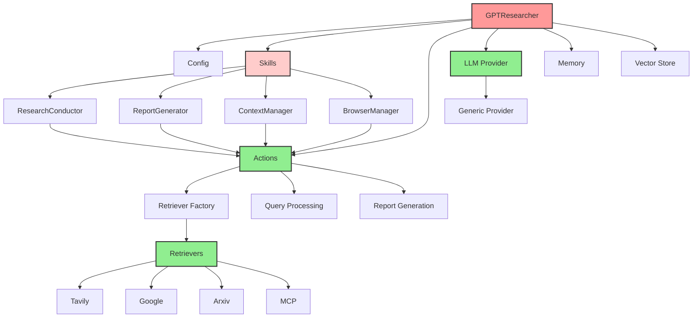

# GPT Researcher 模块化与耦合分析文档

## 1. 包 → 子包 → 模块 → 类的层级划分

### 1.1 整体层级结构

```
gpt-researcher/
├── gpt_researcher/                    # 核心包
│   ├── __init__.py                   # 主入口，导出 GPTResearcher
│   ├── agent.py                      # 中央协调器类（468行）
│   ├── prompts.py                    # 提示词管理
│   │
│   ├── config/                       # 配置管理模块
│   │   ├── config.py                 # 配置类（278行）
│   │   ├── variables/                # 配置变量
│   │   │   ├── base.py              # 基础配置类型
│   │   │   └── default.py           # 默认配置
│   │   └── __init__.py
│   │
│   ├── actions/                      # 业务逻辑层（弱耦合）
│   │   ├── agent_creator.py         # 代理创建逻辑
│   │   ├── query_processing.py      # 查询处理
│   │   ├── report_generation.py     # 报告生成
│   │   ├── retriever.py             # 检索器工厂
│   │   ├── web_scraping.py          # 网页抓取
│   │   ├── utils.py                 # 通用工具
│   │   └── __init__.py
│   │
│   ├── skills/                       # 技能模块（强耦合）
│   │   ├── researcher.py            # 研究协调（150行）
│   │   ├── writer.py                # 报告生成技能
│   │   ├── context_manager.py       # 上下文管理
│   │   ├── browser.py               # 浏览器管理
│   │   ├── curator.py               # 源管理器
│   │   ├── deep_research.py         # 深度研究
│   │   └── __init__.py
│   │
│   ├── llm_provider/                 # LLM 抽象层（弱耦合）
│   │   ├── generic/                 # 通用提供者实现
│   │   │   └── base.py              # 基础提供者类
│   │   └── __init__.py
│   │
│   ├── retrievers/                   # 数据检索策略（工厂模式）
│   │   ├── bing/                    # Bing 搜索实现
│   │   ├── duckduckgo/              # DuckDuckGo 实现
│   │   ├── google/                  # Google 搜索实现
│   │   ├── tavily/                  # Tavily 实现
│   │   ├── arxiv/                   # ArXiv 实现
│   │   ├── pubmed_central/          # PubMed 实现
│   │   ├── mcp/                     # MCP 检索器
│   │   ├── utils.py                 # 检索器工具
│   │   └── __init__.py
│   │
│   ├── document/                     # 文档加载策略
│   ├── context/                      # 上下文压缩
│   ├── memory/                       # 记忆和嵌入
│   │   ├── embeddings.py            # 嵌入模型管理
│   │   └── memory.py                # 记忆类
│   ├── vector_store/                 # 向量存储抽象
│   │   └── vector_store.py          # 向量存储包装器
│   │
│   └── utils/                        # 工具函数
│       ├── llm.py                   # LLM 通用接口
│       ├── costs.py                 # 成本计算
│       ├── logging.py               # 日志工具
│       └── ...
│
├── backend/                          # 后端服务模块
│   ├── server/                       # FastAPI 服务器
│   │   ├── server.py                # 主服务器
│   │   ├── websocket_manager.py     # WebSocket 管理
│   │   └── fast_api_app.py          # FastAPI 应用
│   ├── chat/                        # 聊天功能
│   └── report_type/                 # 报告类型处理
│
├── multi_agents/                     # 多代理系统（独立架构）
│   ├── agents/                       # 代理实现
│   │   ├── chief_editor_agent.py     # 主编辑代理
│   │   ├── research_agent.py         # 研究代理
│   │   ├── writer_agent.py           # 写作代理
│   │   └── ...
│   ├── graphs/                       # 工作流图
│   └── langgraph.json                # LangGraph 配置
│
└── frontend/                         # 前端界面
    ├── index.html                    # HTML 主界面
    ├── nextjs/                       # Next.js 前端
    └── static/                       # 静态资源
```

### 1.2 模块职责边界

#### 核心模块职责
| 模块 | 主要职责 | 边界清晰度 |
|------|---------|-----------|
| `agent.py` | 研究流程总协调 | 中（职责过多） |
| `config/` | 配置管理和验证 | 高 |
| `actions/` | 纯业务逻辑 | 高 |
| `skills/` | 协调化技能 | 中（耦合度高） |
| `llm_provider/` | LLM 抽象层 | 高 |
| `retrievers/` | 数据检索策略 | 高 |

## 2. 模块间依赖与耦合方式

### 2.1 强耦合部分

#### 1. GPTResearcher 主类（高内聚，紧耦合）
**位置**: `gpt_researcher/agent.py`

**耦合问题**:
- 468 行代码，承担过多职责
- 在构造函数中直接实例化所有技能类
- 技能类接收整个 researcher 实例，造成双向耦合

```python
# 第 162-169 行：直接实例化所有技能
self.research_conductor: ResearchConductor = ResearchConductor(self)
self.report_generator: ReportGenerator = ReportGenerator(self)
self.context_manager: ContextManager = ContextManager(self)
self.scraper_manager: BrowserManager = BrowserManager(self)
self.source_curator: SourceCurator = SourceCurator(self)
```

#### 2. 技能模式耦合
**位置**: `gpt_researcher/skills/`

**耦合问题**:
- 所有技能都接收整个 researcher 实例
- 技能直接访问 researcher 属性（cfg、websocket 等）
- 创建难以测试的隐式依赖

```python
# skills/context_manager.py - 第 11 行
def __init__(self, researcher):
    self.researcher = researcher
    # 直接访问 researcher 的属性
    self.cfg = researcher.cfg
    self.websocket = researcher.websocket
```

#### 3. 配置系统耦合
**位置**: `gpt_researcher/config/config.py`

**耦合问题**:
- 配置类承担多种职责（加载、验证、转换、向后兼容）
- 与环境变量系统紧耦合
- 弃用属性处理混入核心逻辑

### 2.2 弱耦合部分

#### 1. Actions 业务逻辑层
**位置**: `gpt_researcher/actions/`

**优势**:
- 纯函数，清晰的输入输出
- 无内部状态
- 易于测试和重用
- 最小化依赖

```python
# actions/query_processing.py
async def generate_sub_queries(
    query: str,
    parent_query: str,
    report_type: str,
    context: List[Dict[str, Any]],
    cfg: Config,
    **kwargs
) -> List[str]:
    # 纯函数，无副作用
```

#### 2. LLM 提供商抽象
**位置**: `gpt_researcher/llm_provider/`

**优势**:
- 多个 LLM 提供商的清晰抽象
- 通用提供者接口
- 适当的错误处理

#### 3. 检索器工厂模式
**位置**: `gpt_researcher/actions/retriever.py`

**优势**:
- 创建检索器的工厂模式
- 检索器类的延迟加载
- 适当的回退处理

```python
# 第 11-70 行：工厂模式实现
def get_retriever(retriever: str):
    match retriever:
        case "google":
            from gpt_researcher.retrievers import GoogleSearch
            return GoogleSearch
        # ... 其他检索器
```

### 2.3 依赖关系图



## 3. 强耦合与弱耦合部分标注

### 3.1 强耦合部分（需要重构）

| 模块/类 | 耦合类型 | 耦合原因 | 重构优先级 |
|---------|---------|---------|-----------|
| `GPTResearcher` | 类间耦合 | 承担过多职责，直接实例化所有依赖 | 高 |
| `Skills` | 双向耦合 | 接收整个 researcher 实例 | 高 |
| `Config` | 功能耦合 | 配置、验证、转换混合 | 中 |

### 3.2 弱耦合部分（良好设计）

| 模块/类 | 解耦方式 | 优势 |
|---------|---------|------|
| `Actions` | 纯函数 | 无状态，易测试 |
| `Retrievers` | 工厂模式 | 易扩展，低耦合 |
| `LLM Provider` | 抽象层 | 统一接口，易替换 |
| `Memory/Vector Store` | 接口隔离 | 职责单一 |

## 4. 设计模式分析

### 4.1 已使用的设计模式

#### 1. 工厂模式（Factory Pattern）
**实现**: `actions/retriever.py` 中的检索器选择

```python
def get_retriever(retriever: str):
    match retriever:
        case "google":
            from gpt_researcher.retrievers import GoogleSearch
            return GoogleSearch
        case "tavily":
            from gpt_researcher.retrievers import TavilySearch
            return TavilySearch
```

**优点**:
- 解耦客户端代码与具体实现
- 易于添加新检索器
- 集中化创建逻辑

#### 2. 策略模式（Strategy Pattern）
**实现**: 多种检索策略和报告类型

**优点**:
- 算法可在运行时选择
- 易于添加新策略
- 关注点分离清晰

#### 3. 依赖注入（Dependency Injection）
**实现**: 整个系统的配置注入

```python
# agent.py - 第 120 行
self.cfg = Config(config_path)
```

**优点**:
- 更容易使用模拟配置进行测试
- 灵活的配置源
- 更好的模块化

#### 4. 技能模式（Skill-Based Architecture）
**实现**: 协调研究任务的模块化技能

**优点**:
- 专业知识封装
- 可组合能力
- 清晰的职责边界

### 4.2 缺失的设计模式

#### 1. 依赖注入容器
**当前问题**: 手动实例化依赖
**建议**: 使用 DI 容器更好地管理依赖

```python
# 建议的实现
class DIContainer:
    def __init__(self, config: Config):
        self.config = config
        self._services = {}
    
    def register(self, interface: Type, implementation: Type):
        self._services[interface] = implementation
    
    def get(self, interface: Type) -> Any:
        implementation = self._services.get(interface)
        if implementation:
            return implementation(self.config)
        return None
```

#### 2. 观察者模式（Observer Pattern）
**当前问题**: 进度更新耦合在主类中
**建议**: 使用观察者模式解耦事件处理

## 5. 重构建议

### 5.1 高优先级重构

#### 1. 拆分 GPTResearcher 类
**问题**: God 类，468 行，职责过多
**建议**: 提取协调逻辑到独立类

```python
# 建议的重构
class ResearchOrchestrator:
    def __init__(self, config: Config, skills: Dict[str, Skill]):
        self.config = config
        self.skills = skills
    
    async def conduct_research(self, query: str) -> List[str]:
        # 协调逻辑
        pass

class GPTResearcher:
    def __init__(self, query: str, **kwargs):
        self.query = query
        self.config = Config(kwargs.get('config_path'))
        
        # 使用依赖注入
        container = DIContainer(self.config)
        self.orchestrator = container.get(ResearchOrchestrator)
```

#### 2. 重构技能接口
**问题**: 技能接收整个 researcher 实例
**建议**: 定义清晰的技能接口

```python
# 建议的技能接口
class ResearchSkill(ABC):
    @abstractmethod
    async def execute(self, context: SkillContext) -> Any:
        pass

class SkillContext:
    def __init__(self, config: Config, websocket=None, **kwargs):
        self.config = config
        self.websocket = websocket
        self.kwargs = kwargs

# 使用示例
class ResearchConductor(ResearchSkill):
    async def execute(self, context: SkillContext) -> List[str]:
        # 只依赖需要的上下文
        pass
```

### 5.2 中优先级重构

#### 1. 配置系统重构
**问题**: 配置类承担多种职责
**建议**: 分离关注点

```python
# 建议的配置架构
class ConfigLoader:
    @staticmethod
    def load(config_path: str) -> Dict[str, Any]:
        # 仅负责加载
        pass

class ConfigValidator:
    @staticmethod
    def validate(config: Dict[str, Any]) -> bool:
        # 仅负责验证
        pass

class ConfigConverter:
    @staticmethod
    def convert_types(config: Dict[str, Any]) -> Dict[str, Any]:
        # 仅负责类型转换
        pass

class Config:
    def __init__(self, config_path: str | None = None):
        # 组合各种功能
        pass
```

#### 2. 事件系统重构
**问题**: 回调处理分散
**建议**: 统一事件系统

```python
# 建议的事件系统
class EventBus:
    def __init__(self):
        self._listeners = {}
    
    def subscribe(self, event_type: str, listener: Callable):
        pass
    
    def publish(self, event_type: str, data: Any):
        pass

# 使用示例
event_bus = EventBus()
event_bus.subscribe('research_progress', progress_handler)
event_bus.publish('research_progress', {'step': 'completed', 'progress': 100})
```

## 6. 模块化评分

### 6.1 评分标准
- **耦合度**: 模块间依赖的紧密程度（0-10，越低越好）
- **内聚度**: 模块内部功能的关联程度（0-10，越高越好）
- **可测试性**: 模块易于测试的程度（0-10，越高越好）
- **可扩展性**: 模块易于扩展的程度（0-10，越高越好）

### 6.2 各模块评分

| 模块 | 耦合度 | 内聚度 | 可测试性 | 可扩展性 | 总分 |
|------|-------|-------|---------|---------|------|
| `agent.py` | 8 | 7 | 4 | 5 | 6/10 |
| `config/` | 6 | 8 | 7 | 8 | 7.25/10 |
| `actions/` | 2 | 9 | 10 | 9 | 7.5/10 |
| `skills/` | 9 | 8 | 4 | 6 | 6.75/10 |
| `llm_provider/` | 3 | 9 | 8 | 9 | 7.25/10 |
| `retrievers/` | 4 | 8 | 9 | 9 | 7.5/10 |

### 6.3 总体评分：7/10

**优势**:
1. 清晰的模块分离和职责定义
2. 检索器的工厂模式提供了良好的扩展性
3. 核心架构中没有循环依赖
4. LLM 提供商和检索器有良好的抽象层
5. 技能架构提供了良好的关注点分离

**改进空间**:
1. GPTResearcher 类过大且职责过多
2. 技能耦合可以通过更好的接口定义来改进
3. 由于紧耦合，测试面临挑战
4. 配置复杂性可以更好地组织

## 7. 总结

GPT Researcher 项目整体展现了良好的模块化设计原则，具有清晰的关注点分离。主要问题集中在核心类的耦合度过高，特别是 GPTResearcher 主类和技能系统。通过实施建议的重构，特别是引入依赖注入和定义清晰的接口，可以显著提高代码的可维护性、可测试性和可扩展性。